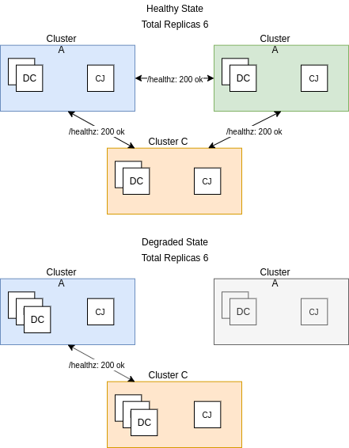

# OpenShift 4 HA CronJob

OpenShift template to deploy a CronJob suitable for maintaining a desired number of application replicas accross multiple OpenShift clusters.

## What is the purpose of this template?

A CronJob is configured in each OpenShift cluster. The purpose of this CronJob is to ping the /healthz endpoint of each _other_ OpenShift cluster to determine whether it is still reporting as healthy. If an OpenShift cluster is no longer reporting healthy the CronJob will automatically scale the designated application to accommodate the missing replicas. 

For example lets use the situation where there are 3 OpenShift clusters with 2 application replicas in each.

If a single cluster goes down each remaining cluster will increase its capacity by 1.
If two clusters go down the remaining cluster will increase its capacity by 4.

When the CronJob detects that the alternate clusters are helathy they will scale the application back down to its original replica count.



## Quickstart 

The following should be done for each OpenShift cluster. 

```shell script
# Create application
oc new-project app-a
oc new-app httpd-example -n app-a

# Set environment specific parameters
this_cluster_api_url=https://api.ocp4north.example.domain:6443
alternate_cluster_api_url_list=https://api.ocp4east.example.domain:6443,https://api.ocp4west.example.domain:6443
deployment_name=httpd-example
deployment_project=app-a

# Grant service account permission
oc policy add-role-to-user edit system:serviceaccount:${app_project}:ha-cronjob-${deployment_name} -n ${app_project}

# Deploy CronJob
oc process -f job_template.yaml \
  -p DEPLOYMENT_PROJECT=${deployment_project} \
  -p THIS_CLUSTER_API_URL=${this_cluster_api_url} \
  -p ALTERNATE_CLUSTER_API_URL_LIST=${alternate_cluster_api_url_list} \
  -p DEPLOYMENT_NAME=${deployment_name} \
  | oc create -n ${app_project} -f -
```

## Template Parameters

The list of parameters this template accepts can be listed with the following command:

```shell script
oc process --parameters -f job_template.yaml
```

## Miscellaneous
```shell script
# Build CronJob image
oc start-build ha-cronjob-${deployment_name} -n ${deployment_project} 

# Create job manually
oc create job -n ${deployment_project} --from=cronjob/ha-cronjob-${deployment_name} ha-cronjob-${deployment_name}-manual
```

