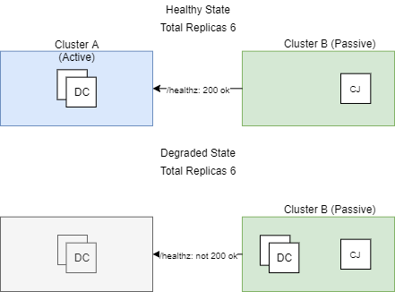

# OpenShift HA CronJob

OpenShift template to deploy a CronJob suitable for maintaining a desired number of application replicas across multiple OpenShift clusters.

## What problem does this solve?

To maintain a consistent number of stateless application replicas across multiple OpenShift clusters, tolerant to cluster failure.

## How does it work?

The main mechanism that achieves this goal is a [CronJob](https://docs.openshift.com/container-platform/latest/nodes/jobs/nodes-nodes-jobs.html) running alongside each application [Deployment/DeploymentConfig](https://docs.openshift.com/container-platform/latest/applications/deployments/what-deployments-are.html) in each cluster.

### Active-Active (2+N Active Clusters)

The CronJob in each cluster is given the Cluster API URL for each _other_ cluster and monitors their [/healthz](https://github.com/openshift/origin/blob/master/docs/proposals/instrumentation-of-services.md) endpoint. When a non ```200 ok``` response is detected the number of application replicas is adjusted to ensure a consistent number of replicas across all remaining clusters.

Each cluster is responsible for maintaining its own replica count and assumes each _other_ cluster is configured to do the same.


For example with 3 OpenShift clusters configured to be active with 2 application replicas in each.

If a single cluster goes down each remaining clusters will increase their capacity by 1.
If two clusters go down the remaining cluster will increase its capacity by 4.

When the CronJob detects that the alternate clusters are healthy they will scale the application replicas back down to its original replica count of 2.

### Active-Passive (1+N Active Clusters, 1 Passive Cluster)

The CronJob in each active cluster is configured as described above in the Active-Active configuration with the Cluster API URL's for each _other_ *active* cluster. If there are only two clusters, one active and one passive, the active cluster does not need to be configured with the CronJob.
The CronJob in the single Passive cluster is also configured with the Cluster API Url's for each active cluster and will scale its application replicas to 0.

If all active clusters are unhealthy the passive cluster will scale the number of application replicas it is responsible for from 0 to the total desired replica count.



## Does this branch work with OpenShift 4?

No. This branch is intended to work against 3.x clusters only. There is another branch that should work against 4.x clusters.

The main constraint with having this work across the 3-4 cluster boundary is the oc client version in the BuildConfig and the image registry DNS name in the CronJob. 

## Quickstart 

The following should be done for each OpenShift cluster. 

```shell script
# Create application
oc new-project app-a
oc new-app httpd-example -n app-a

# Set environment specific parameters - replace with parameters relevant to your environment
# Pay attention that the url does not have a trailing slash
this_cluster_api_url=https://api.ocp4north.example.domain:6443
alternate_cluster_api_url_list=https://api.ocp4east.example.domain:6443,https://api.ocp4west.example.domain:6443
deployment_name=httpd-example
deployment_project=app-a

# Deploy template - there are more than the below parameters
oc process -f job_template.yaml \
  -p DEPLOYMENT_PROJECT=${deployment_project} \
  -p THIS_CLUSTER_API_URL=${this_cluster_api_url} \
  -p ALTERNATE_CLUSTER_API_URL_LIST=${alternate_cluster_api_url_list} \
  -p DEPLOYMENT_NAME=${deployment_name} \
  | oc create -n ${deployment_project} -f -
```

## Template Parameters

The list of parameters this template accepts can be listed with the following command:

```shell script
oc process --parameters -f job_template.yaml
```

## Adding additional functionality

The core logic of this is contained in the ansible playbook that gets run in the Job container, which is defined as a ConfigMap in this template. It would be trivial to extend the functionality of this by adding additional logic to the ansible playbook. 

## Miscellaneous Useful Commands
```shell script
# Set environment specific parameters - replace with parameters relevant to your environment
deployment_name=httpd-example
deployment_project=app-a

# Build CronJob image
oc start-build ha-cronjob-${deployment_name} -n ${deployment_project} 

# Create job manually
oc create job -n ${deployment_project} --from=cronjob/ha-cronjob-${deployment_name} ha-cronjob-${deployment_name}-manual

# Delete all objects from particular template
oc delete all -l app.kubernetes.io/instance=ha-cronjob-${deployment_name} -n ${deployment_project} \
  && oc delete sa ha-cronjob-${deployment_name} -n ${deployment_project} \
  && oc delete cm ha-cronjob-${deployment_name} -n ${deployment_project} \
  && oc delete rolebinding cm ha-cronjob-${deployment_name}-edit -n ${deployment_project}
```

